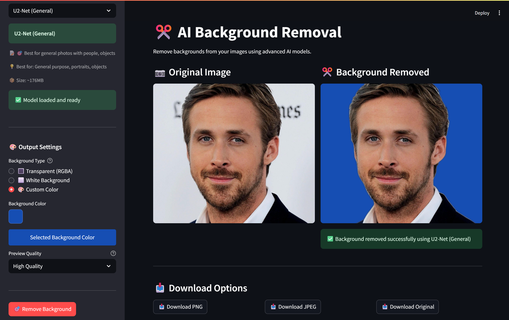
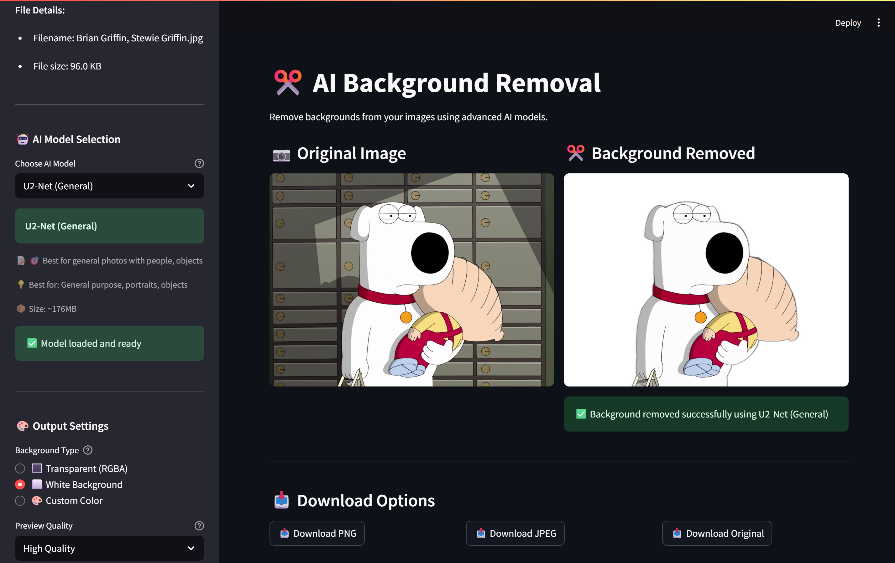
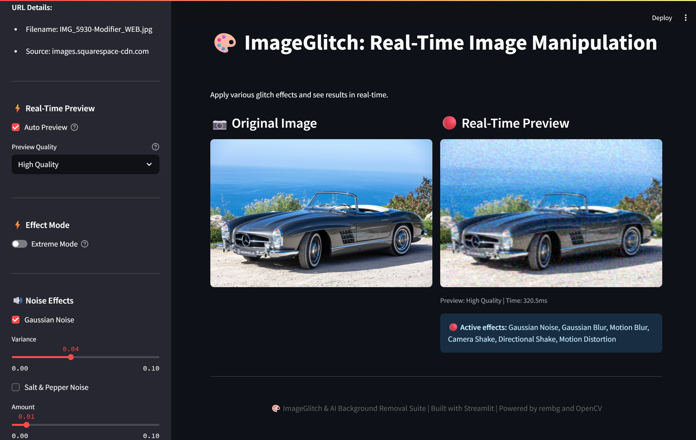

# 🚀 Getting Started

## Installation Instructions

### Local Installation

1. **Clone the repository**:
   ```bash
   git clone https://github.com/binayakbartaula11/ImageGlitch.git
   cd ImageGlitch
   ```

2. **Install dependencies** using pip:
   ```bash
   pip install -r requirements.txt
   ```

3. **Optional - AI Background Removal**:
   For optimal results with background removal, install `rembg`:
   ```bash
   pip install rembg
   ```

4. **Run the application**:
   ```bash
   streamlit run app.py
   ```

   Open the application in your browser at `http://localhost:8501`.

### Cloud Deployment

For deploying on cloud platforms, consider using a service such as AWS EC2, Heroku, or Google Cloud Platform. Make sure to configure your domain and firewall settings to allow access to the Streamlit application port.

## System Requirements

### Minimum Requirements

- **Operating System**: Windows, macOS, or Linux
- **Python Version**: 3.7+
- **RAM**: 4GB
- **Storage**: 1GB for AI models
- **Internet**: Required for the initial download of AI models

### Recommended Configuration

- **Python Version**: 3.9+
- **RAM**: 8GB or more
- **GPU**: NVIDIA GPU with CUDA support (optional)
- **Storage**: 2GB+

## Quick Start Example

1. **Upload an Image**: Drag and drop an image file into the app's upload section.

2. **Select AI Model**: Choose the AI model based on your needs (e.g., U2-Net for general-purpose images).

3. **Set Output Preferences**: Decide between transparent, white, or custom backgrounds.

4. **Apply Glitches**: Customize the visual effects via the sidebar, adjusting options like noise, blur, and shake intensity.

5. **Preview and Save**: Visualize changes in real time and download the final result.

## 📸 Example Screenshots

Here are some screenshots demonstrating ImageGlitch’s core features and UI:

| Custom Background Color                                  | White Background                                       | Image Glitch Effect (Mercedes 300SL)                   |
| ------------------------------------------------------- | ----------------------------------------------------- | ------------------------------------------------------ |
|  |  |  |

These images illustrate background removal with custom and white backgrounds, as well as the glitch effect output.

---

*Next: [User Guide →](user-guide.md)*
